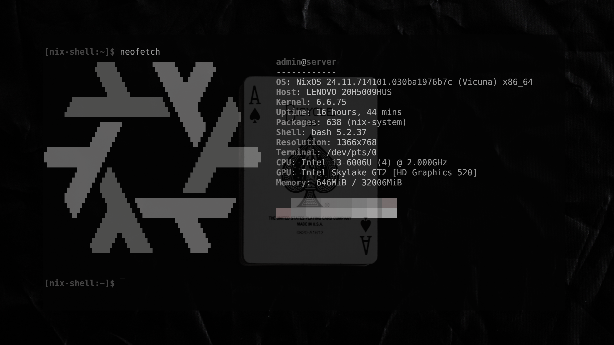

# Overview
This repo contains the docker compose files structure and future plans of my modular server architechture that can be deployed on any linux server but meant to be built upon the server config in my dotfiles.

# file structure
/mnt/tank -- where the bulk files are stored
/srv/containers -- where docker compose files are stored with the containers config directories
/srv/data/{user} -- where files are that are mounted using sshfs to other clients eg Documents folder mounted to both laptop and desktop
/srv/websites -- self explanitory

# backups !! work in progress !!

# services
- [x] file syncing
- [x] immich
- [x] home assistant
- [x] frigate
- [x] arr stack
- [ ] vaultwarden
- [ ] ai
- [ ] code repo
- [ ] container repo
- [ ] websites
- [x] proxy
- [ ] openTime
- [ ] email

